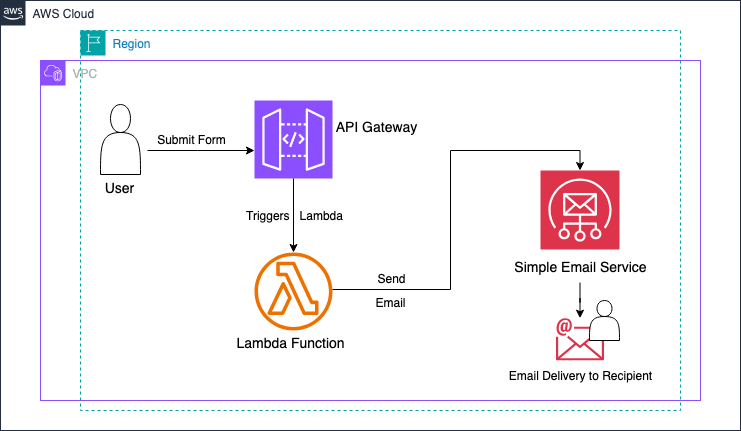

# AWS Serverless Contact Form API

A fully serverless contact form API built using **AWS Lambda**, **API Gateway**, and **Amazon SES** for sending emails. This project demonstrates a scalable, cost-efficient serverless architecture to handle form submissions without managing servers.

---

## Table of Contents

- [Project Overview](#project-overview)
- [Architecture](#architecture)
- [Architecture Diagram](#architecture-diagram)
- [Features](#features)
- [Tech Stack](#tech-stack)
- [Setup & Installation](#setup--installation)
- [Deployment](#deployment)
- [Testing](#testing)
- [Environment Variables](#environment-variables)
- [Error Handling & Logging](#error-handling--logging)
- [Contributing](#contributing)
- [License](#license)

---

## Project Overview

This project provides an API endpoint for a contact form that:

- Accepts `name`, `email`, and `message` via HTTP POST requests.
- Sends the message to a designated email using Amazon SES.
- Returns appropriate success or error responses.

It is fully serverless and can scale automatically.

---

## Architecture

```mermaid
Client (Web/App)
      |
      v
API Gateway (REST API)
      |
      v
AWS Lambda (Python)
      |
      v
Amazon SES (Email Service)
````

## Architecture Diagram

[](assets/diagram.png)

**Key Points:**

* **API Gateway** handles incoming HTTP requests.
* **Lambda** processes the requests and interacts with SES.
* **SES** sends emails to recipients.
* **IAM Roles** ensure least privilege access for Lambda functions.
* **CloudWatch** logs Lambda executions for monitoring.

---

## Features

* Serverless and fully managed.
* JSON API for contact form submissions.
* Email notifications via SES.
* Input validation and error handling.
* Easily deployable via AWS Console, Serverless Framework, or Terraform.

---

## Tech Stack

* **AWS Lambda** – Serverless compute
* **API Gateway** – REST API routing
* **Amazon SES** – Email delivery
* **Python 3.12** – Runtime (can be Node.js if desired)
* **AWS IAM** – Permissions management
* **CloudWatch Logs** – Monitoring and debugging

---

## Setup & Installation

1. **Clone the repository:**

```bash
git clone https://github.com/Stennis1/aws-serverless.git
cd project_dir
```

2. **Configure AWS CLI:**

```bash
aws configure
```

Ensure your IAM user has permissions for Lambda, SES, API Gateway, and CloudWatch.

3. **Verify SES domain/email:**

* Verify your sender and recipient emails in Amazon SES.
* Set SES to **production mode** if required.

---

## Deployment

### Manual AWS Deployment

1. Zip the Lambda function and upload via AWS Console (or post code and deploy in Lambda's Code editor).
2. Create API Gateway REST API.
3. Connect the Lambda function as POST `/contact`.
4. Set up IAM roles with SES send permissions.

> **Note**:  
Set up environment variables (envs) in Lambda function -> Check [Environment Variables](#environment-variables).
---

## Testing

1. **Using Curl:**

```bash
curl -X POST https://<api-id>.execute-api.<region>.amazonaws.com/<stage>/contact \
-H "Content-Type: application/json" \
-d '{
  "name": "John Doe",
  "email": "john@example.com",
  "message": "Hello from AWS Serverless API"
}'
```

2. **Using Postman**

- Paste api url: e.g: https://<api-id>.execute-api.<region>.amazonaws.com/<stage>/contact.
- Select **POST** as method header.
- Under **body**, Select **raw** and **JSON** format.
- Click **Send**

3. **Expected Response Example:**

```json
{
  "status": "success",
  "message": "Email sent successfully."
}
```

4. **Error Response Example:**

```json
{
  "status": "error",
  "message": "Invalid request body"
}
```

---

## Environment Variables

Set the following environment variables for the Lambda function:

| Variable        | Description                          |
| --------------- | ------------------------------------ |
| `SES_SENDER`    | Verified sender email in SES         |
| `SES_RECIPIENT` | Recipient email address              |
| `AWS_REGION`    | AWS region for SES (e.g., us-east-1) |

---

## Error Handling & Logging

* All Lambda logs are available in **CloudWatch Logs**.
* HTTP 500 indicates server-side errors; HTTP 400 for invalid requests.
* Ensure SES is verified and in the correct region.

---

## Contributing

1. Fork the repository.
2. Create a feature branch (`git checkout -b feature/my-feature`).
3. Commit changes (`git commit -m 'Add feature description'`).
4. Push branch (`git push origin feature/my-feature`).
5. Open a pull request.

---

## License

This project is licensed under the MIT License. See [LICENSE](https://opensource.org/license/mit) for details.


